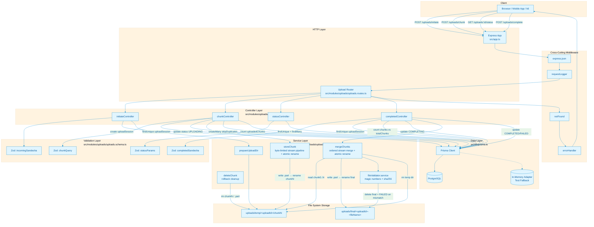
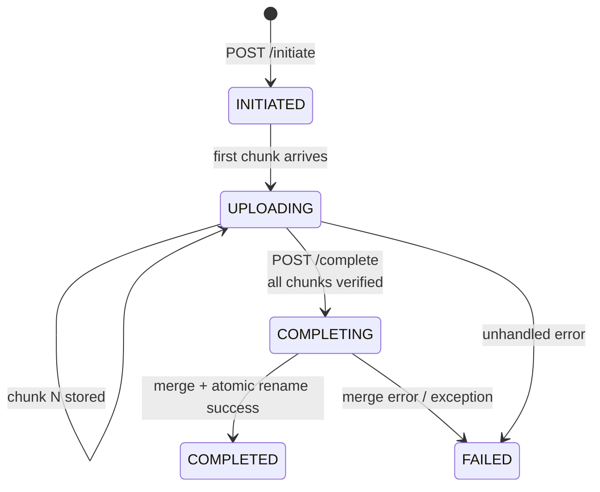

# Frusta


```text
______              _        
|  ___|            | |       
| |_ _ __ _   _ ___| |_ __ _ 
|  _| '__| | | / __| __/ _` |
| | | |  | |_| \__ \ || (_| |
\_| |_|   \__,_|___/\__\__,_|
```

`manual single-node chunking engine | s3-style upload semantics | resumable + idempotent`

Frusta is a manual, S3-style chunk upload engine built on Node.js + Express + Prisma.
It accepts out-of-order and parallel chunk uploads, supports resume, enforces idempotency, and merges to a final artifact using atomic file operations.

## What It Solves

- Upload large files reliably over unstable networks.
- Resume interrupted uploads without re-sending completed chunks.
- Prevent duplicate chunk corruption under retries/races.
- Keep merge and cleanup deterministic with explicit upload session states.

## Core Features

- Chunked upload lifecycle: `INITIATED -> UPLOADING -> COMPLETING -> COMPLETED | FAILED`
- Out-of-order chunk acceptance
- Parallel chunk upload support
- Resume support via uploaded-chunk introspection endpoint
- Duplicate chunk protection:
  - Filesystem guard (`chunkN` existence check)
  - DB uniqueness (`@@unique([uploadSessionId, chunkIndex])`)
  - `createMany(..., skipDuplicates: true)` idempotency
- Safe write path:
  - Chunk write to `.part` then atomic rename to `chunkN`
  - Final merge to `<uploadId>-<fileName>.part` then atomic rename to final file
- Automatic temp cleanup after successful merge
- Failure rollback in chunk ingest path (if DB write fails after file write, chunk file is removed)
- Zod request validation for body/query/params with per-field error details
- Input hardening:
  - Global limits: `fileSize <= 5 GiB`, `totalChunks <= 10,000`, `chunkIndex` bounded
  - `fileName` sanitization: no path separators / control characters, re-verified at merge (path-traversal safe)
  - Cross-field refines: `fileSize >= totalChunks`, `fileSize <= totalChunks * 16 MiB`
  - Chunk `content-length` gate: required (`411`), positive integer, `<= 16 MiB` (`413`)
  - Stream byte-limiter: aborts mid-upload when streamed bytes exceed the cap (catches lying clients)
  - Per-chunk quota: a chunk cannot push the uploaded total past the declared `fileSize`
  - Content-type gate: chunk bodies must be `application/octet-stream` (`415`), so the body parser can never consume the upload stream
- Content-level validation:
  - Video extension allowlist at initiate: `.mp4 .m4v .webm .mkv .mov`
  - Magic-number fingerprinting of the merged bytes via `file-type` — renamed executables/text are rejected even with a valid name
  - Optional `sha256` checksum declared at complete, verified against the merged bytes with a streaming hash
  - Merged size must exactly equal the declared `fileSize`
  - Failed content checks delete the final artifact and mark the session `FAILED`
- Centralized error and not-found middleware (body-parser failures mapped to `400`/`413`)
- Request logging middleware with latency printouts
- Test-time in-memory Prisma fallback for fast deterministic integration testing

## Architecture

### System Diagram



### Upload Session State Machine



### Data Flow Highlights

1. **Initiate**: Client → Router → `initiateController` → Zod validation → Prisma (`uploadSession.create`) → `prepareUploadDir` → Temp directory created.
2. **Chunk Ingest**: Client → Router → `chunkController` → Zod validation → Prisma (`uploadSession.findUnique` + `update`) → `storeChunk` (stream pipeline, atomic `.part` → `chunkN` rename) → Prisma (`uploadChunk.createMany` with `skipDuplicates`) → On DB failure, `deleteChunk` rolls back the file.
3. **Status / Resume**: Client → Router → `statusController` → Prisma (`uploadSession.findUnique` + `uploadChunk.findMany`) → Returns `uploadedChunks[]` array.
4. **Complete / Merge**: Client → Router → `completedController` → Zod validation → Prisma (`count` verification) → Status `COMPLETING` → `mergeChunks` (ordered stream pipeline into `.part`, atomic rename to final, recursive temp cleanup) → Prisma status `COMPLETED` (or `FAILED` on error).

## Upload Flow

1. `POST /uploads/initiate` creates an upload session row and a temp directory for `uploadId`.
2. `POST /uploads/chunk` stores raw chunk bytes (`application/octet-stream`) by `chunkIndex`.
3. Clients can upload chunks in any order, retry safely, and in parallel.
4. `GET /uploads/:uploadId/status` returns `uploadedChunks[]` so clients resume only missing indexes.
5. `POST /uploads/complete` verifies `uploadedChunks === totalChunks`, merges in index order, atomically renames final artifact, then deletes temp chunk directory.

5. `POST /uploads/complete` verifies `uploadedChunks === totalChunks`, merges in index order, atomically renames the final artifact, verifies its size, magic numbers, and optional sha256 checksum, then deletes the temp chunk directory.

## Validation Layers

Request content is verified by what the bytes are, not what the name claims:

| Gate | Where | On failure |
|---|---|---|
| Extension allowlist (video only) | initiate (schema) | `400`, nothing stored |
| fileName sanitization (no traversal) | initiate (schema) + merge (service) | `400` / merge refused |
| Global limits (`fileSize`, `totalChunks`, `chunkIndex`) | initiate / chunk (schema) | `400` with field details |
| `content-length` required, positive, `<= 16 MiB` | chunk (controller) | `411` / `400` / `413` |
| Stream byte-limiter (actual bytes on the wire) | chunk (service) | `413`, stream aborted, temp file removed |
| Per-chunk quota vs declared `fileSize` | chunk (controller) | `400` before any write |
| `application/octet-stream` content-type | chunk (controller) | `415` |
| Session state guard | chunk / complete (controller) | `409` |
| Merged size == declared `fileSize` | complete (service) | `400`, final file deleted, session `FAILED` |
| Magic numbers (`file-type`) must be an allowed video mime | complete (service) | `400`, final file deleted, session `FAILED` |
| Declared sha256 checksum matches merged bytes | complete (service, optional) | `400`, final file deleted, session `FAILED` |

## API

Base path: `/uploads`

All validation failures return `400` (`success: false`) with `data` mapping each rejected field to its error messages:

```json
{
  "success": false,
  "statusCode": 400,
  "message": "Validation failed",
  "data": { "fileName": ["fileName contains illegal path characters"] }
}
```

### 1) Initiate Upload

- `POST /uploads/initiate`
- Body:

```json
{
  "fileName": "video.mp4",
  "fileSize": 734003200,
  "totalChunks": 128
}
```

- Success: `201`

```json
{
  "success": true,
  "statusCode": 201,
  "message": "upload session initiated",
  "data": { "uploadId": "uuid" }
}
```

### 2) Upload Chunk

- `POST /uploads/chunk?uploadId=<uuid>&chunkIndex=<int>`
- Headers: `Content-Type: application/octet-stream` (anything else → `415`)
- Body: raw chunk bytes; a `content-length` header is required (`411`), must be a positive integer and at most 16 MiB (`413`); a chunk that would push the uploaded total past the declared `fileSize` is rejected (`400`)
- Success: `200`

```json
{
  "success": true,
  "statusCode": 200,
  "message": "chunk stored",
  "data": { "uploadedChunks": 42, "totalChunks": 128 }
}
```

### 3) Upload Status (Resume API)

- `GET /uploads/:uploadId/status`
- Success: `200`

```json
{
  "success": true,
  "statusCode": 200,
  "message": "upload status fetched",
  "data": {
    "uploadId": "uuid",
    "status": "UPLOADING",
    "uploadedChunks": [0, 1, 2, 5, 6],
    "totalChunks": 128
  }
}
```

### 4) Complete Upload

- `POST /uploads/complete`
- Body:

```json
{
  "uploadId": "uuid",
  "checksum": "64-char sha256 hex of the expected merged bytes (optional)"
}
```

- Success: `200`
- Idempotent behavior: if already completed, returns `200` with `"upload already completed"`.
- When `checksum` is declared, the merged bytes are streamed through sha256 and compared; a mismatch returns `400`, deletes the final file, and marks the session `FAILED`.
- The merged artifact is also verified for exact size and video magic numbers before the session is marked `COMPLETED`.
- `409` when the session is `COMPLETING` (merge in progress) or `FAILED`.

## Storage and Merge Semantics

- Root: `UPLOAD_ROOT` (default: `uploads`)
- Temp chunks: `uploads/temp/<uploadId>/chunk<index>`
- Final artifact: `uploads/final/<uploadId>-<fileName>`
- Chunk and final files are first written as `.part`, then atomically renamed.
- On merge success: temp chunk directory is recursively removed.

## Data Model (Prisma)

### `uploadSession`

- `id` (UUID, PK)
- `fileName`
- `fileSize` (`BigInt`)
- `totalChunks`
- `status` (`INITIATED | UPLOADING | COMPLETING | COMPLETED | FAILED`)
- `mergeStartedAt`, `mergeCompletedAt`
- `createdAt`, `updatedAt`
- Index: `status`

### `uploadChunk`

- `id` (UUID, PK)
- `uploadSessionId` (FK -> `uploadSession`, `onDelete: Cascade`)
- `chunkIndex`
- `size`
- `createdAt`
- Unique constraint: `(uploadSessionId, chunkIndex)`
- Index: `uploadSessionId`

## Project Structure

```text
src/
  app.ts                          # express app wiring + middleware + routes
  server.ts                       # process entrypoint
  config/env.ts                   # zod env validation
  db/prisma.ts                    # prisma client + in-memory test fallback
  middleware/
    requestLogger.middleware.ts
    notFound.middleware.ts
    errorHandler.middleware.ts
  modules/uploads/
    uploads.routes.ts             # upload route map
    uploads.schema.ts             # zod contracts (limits, sanitization, checksum format)
    uploads.controller.ts         # request orchestration + per-request guards
    uploads.service.ts            # fs/stream chunk + merge engine
    fileValidator.service.ts      # magic-number + sha256 verification of merged bytes
    uploads.constants.ts          # statuses, storage paths, upload limits, format allowlists
    uploads.types.ts
  utils/
    apiError.ts
    apiResponse.ts
    asyncHandler.ts
    validation.ts

prisma/
  schema.prisma
  migrations/

tests/
  integration/upload.integration.test.ts
  unit/upload.controller.unit.test.ts
  unit/upload.service.unit.test.ts
  unit/upload.schema.unit.test.ts

benchmarks/
  k6/
    upload-flow.js
    api.js
    checks.js
    options.js
    payload.js
    run.sh
```

## Local Setup

1. Install dependencies:

```bash
npm install
```

2. Configure environment:

```bash
# .env
NODE_ENV=development
PORT=3000
DATABASE_URL=postgresql://<user>:<pass>@<host>:5432/<db>
# optional:
# UPLOAD_ROOT=uploads
```

3. Apply DB schema:

```bash
npx prisma migrate deploy
```

4. Run:

```bash
npm run dev
```

## Environment Variables

- `NODE_ENV`: `development | test | production`
- `PORT`: HTTP port (default `3000`)
- `DATABASE_URL`: required unless using in-memory test mode
- `UPLOAD_ROOT` (optional): storage root (default `uploads`)
- `FRUSTA_TEST_USE_REAL_DB` (optional): when `true` in test mode, bypasses in-memory DB fallback

## NPM Scripts

- `npm run dev`: run server in watch mode via `tsx`
- `npm run test`: run full Vitest suite
- `npm run typecheck`: TypeScript type-check
- `npm run build`: build to `dist/`
- `npm run start`: run compiled server
- `npm run bench:k6:upload`: run k6 flow with env-driven params
- `npm run bench:k6:upload:local`: convenience local benchmark profile

## Testing

Run:

```bash
npm test
```

Current snapshot (run on September 24, 2026):

- `62/62` tests passing
- Unit: `44` (controller `13` + service `10` + schema `21`)
- Integration: `18` (full HTTP upload flow + content-level validation paths)

Notes:

- In `NODE_ENV=test`, DB defaults to in-memory Prisma adapter unless `FRUSTA_TEST_USE_REAL_DB=true`.
- Integration tests cover upload initiation, chunk ingest, out-of-order behavior, status/resume API, complete/merge path, invalid index rejection, path traversal / extension rejections, content-length / quota / content-type gates, and the magic-number + sha256 verification paths (including a renamed-executable payload).
- Full test inventory lives in `tests/tests-description.md`.

## Benchmark (k6) Snapshot

Script: `benchmarks/k6/upload-flow.js`

Run profile used:

- Date: March 12, 2026
- `BASE_URL=http://127.0.0.1:3000`
- `VUS=5`
- `DURATION=15s`
- `CHUNK_SIZE=8`
- `SLEEP_SECONDS=0`
- Server mode: `NODE_ENV=test` (in-memory DB path)

Observed results:

- Checks pass rate: `100%` (`126/126`)
- HTTP failure rate: `0.00%`
- Total HTTP requests: `54`
- Throughput: `1.86 req/s`
- `http_req_duration` avg: `1664.49 ms`
- `http_req_duration` p90: `2081.15 ms`
- `http_req_duration` p95: `2654.46 ms`
- Completed upload iterations: `6`

Threshold status for this run:

- `http_req_failed < 1%`: pass
- `checks > 99%`: pass
- `http_req_duration p95 < 2500ms`: narrowly missed (`2654.46ms`)

## Why This Design Holds Up

- Stream-based writes (`pipeline`) reduce memory pressure and give cleaner backpressure handling.
- Atomic renames protect against partial file visibility.
- Session/chunk split in DB keeps metadata clean and queryable.
- Idempotent chunk semantics make retries safe under network noise and client duplication.
- Content is verified by what the bytes are, not what the name claims: extension allowlist at declare time, magic numbers + exact size + optional sha256 on the merged artifact.
- Limits are enforced twice (schema validates, service enforces), so a misbehaving client cannot outsize its declaration.
- Controller/service separation keeps the upload engine modular and easy to evolve.

## License

This project is licensed under the ISC License.
See [LICENSE](/home/amaan/my_stuff/frusta/LICENSE).
